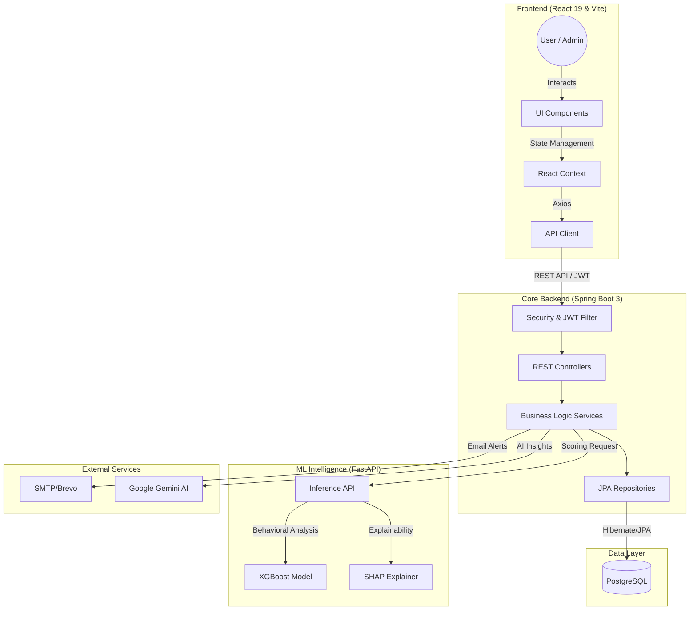
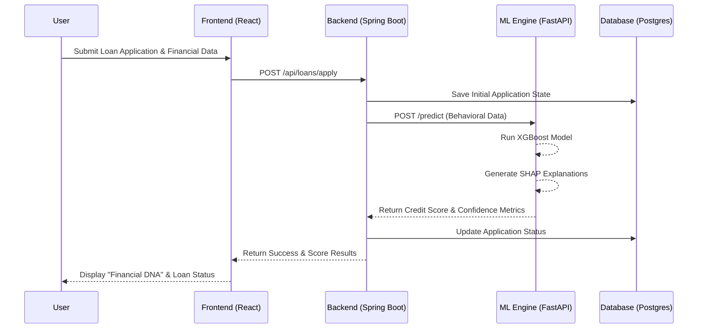

# CreditBridge: AI-Powered Financial Inclusion for the Credit Invisible

[](https://github.com/Aniket-Vasane/Pragyantra-TSMEntity-PS03)
[](https://github.com)

## 🚀 The Vision
In today's economy, millions of creditworthy individuals are "credit invisible"—they lack the traditional history (CIBIL/FICO) required for institutional loans. **CreditBridge** solves this by leveraging **Behavioral AI Analytics** to assess creditworthiness based on alternative data points like income stability, spending patterns, and savings ratios.

---

## 📐 System Architecture

Our system is structured into three main micro-components: the User Interface, the Core Backend, and the Machine Learning Intelligence Engine.



---

## 🔄 Core User Flow

Here is the flow of how a user applies for a loan and receives a behavioral credit score.



---

## 📁 Project Structure

A clean, modular monorepo structure separating the three primary domains:

```text
CreditBridge/
├── backend/                  # Spring Boot Java Application
│   ├── src/main/java/...     # Controllers, Models, Services, Security
│   ├── database_setup.sql    # Initial DB schema and roles
│   └── pom.xml               # Maven dependencies
├── frontend/                 # React 19 + Vite Application
│   ├── src/                  # React components, pages, context, styles
│   ├── server/               # Express proxy/utility server (optional)
│   └── package.json          # Node dependencies
└── ml/                       # Python FastAPI Machine Learning Engine
    ├── data/                 # Training datasets (Synthetic & Real)
    ├── models/               # Model trainers and serialized .pkl files
    ├── processing/           # Data cleaning and feature engineering
    ├── explainability/       # SHAP integration
    ├── api.py                # FastAPI inference server
    └── main.py               # Model training pipeline
```

---

## ✨ Key Features

### 🧠 Behavioral Scoring Engine (ML)
- **Invisible User Underwriting**: Predicts credit scores for users without traditional credit history.
- **Advanced Risk Metrics**: Calculates Probability of Default (PD) and Confidence Scores.
- **SHAP-based Explainability**: Provides transparent "Top Factors" that influenced the AI's decision.
- **Max Loan Recommendation**: Algorithmic determination of safe lending limits.

### 💼 Multi-Role Dashboards
- **User Portal**: Track financial health, view "Financial DNA," and discover matched schemes.
- **Bank Admin**: Seamlessly evaluate loan applications and view AI-driven risk assessments.
- **Super Admin**: Monitor global branch performance and manage system-wide access metrics.

### 💎 Modern UI/UX
- **Smooth Interaction**: Integrated **Lenis** smooth scrolling and **GSAP/Framer Motion** animations.
- **Data Visualization**: Rich, interactive charts using **Recharts** to visualize financial DNA.
- **Responsive Design**: Built with **Tailwind CSS 4** for a premium, mobile-first experience.

### 🛡️ Secure & Scalable Backend
- **Spring Boot 3**: Robust service architecture with JWT-based session management.
- **RBAC**: Fine-grained Role-Based Access Control for bank-grade security.
- **AI Integration**: Leverages Google Gemini for deep financial insights and automated reports.

---

## 💻 Tech Stack

| Component | Technologies |
| :--- | :--- |
| **Frontend** | React 19, Vite, Tailwind CSS 4, Framer Motion, GSAP, Recharts |
| **Backend** | Spring Boot, Java, PostgreSQL, Spring Security (JWT), Hibernate |
| **ML Engine** | FastAPI, Python, XGBoost, SHAP, Scikit-learn, Pandas |
| **Third-Party** | Google Gemini API, Brevo (SMTP), Lucide Icons |

---

## ⚙️ Requirements

- **Java 17+** and Maven
- **Node.js 18+** 
- **Python 3.10+**
- **PostgreSQL 14+**
- API Keys: Google Gemini App Key, Brevo SMTP credentials

---

## 🚀 Step-by-step Setup Guide

### 1. Database Setup
Ensure PostgreSQL is installed and running. Apply the setup script:
```bash
# Log in to your psql console
psql -U postgres
```
```sql
-- Inside PostgreSQL terminal:
CREATE DATABASE credit_scoring;
\c credit_scoring
-- Execute the setup script
\i backend/database_setup.sql
```

### 2. Environment Variables Configuration
For security, credentials are not committed. Set the corresponding environment variables.

**Backend configurations** (Export or set in your IDE):
```bash
export SMTP_PASSWORD="your_brevo_smtp_password"
export GEMINI_API_KEY="your_gemini_api_key"
export JWT_SECRET="your_custom_jwt_secret_optional"
```

**Frontend configuration**:
Create a `.env` file inside the `frontend/` directory:
```env
VITE_GEMINI_API_KEY=your_gemini_api_key_here
```

### 3. ML Intelligence Engine Configuration
Our FastAPI Machine Learning module powers behavioral analytics.
```bash
cd ml
# Create a virtual environment (recommended)
python -m venv venv
# Activate the environment (Windows: `venv\Scripts\activate`)
source venv/bin/activate
# Install requirements
pip install -r utils/requirements.txt

# Initial Setup: Process synthetic data, train the baseline models and serialize them into .pkl 
python main.py 

# Start up the Inference FastAPI service on localhost:8000
python api.py
```

### 4. Running the Spring Boot Backend
Ensure your database `credit_scoring` is up and ML FastAPI is running on `port 8000`.
```bash
cd backend
# Run the Spring Boot application
./mvnw spring-boot:run
```
*The Spring application will boot up at default port `8080`.*

### 5. Running the React Frontend
Open a new terminal session.
```bash
cd frontend
npm install
npm run dev
```
*The app will start on `localhost:5173`.*

---

## 📈 Future Roadmap
- [ ] **Blockchain Integration**: Decentralized identity verification for faster KYC.
- [ ] **Real-time SMS Integration**: Instant loan approval notifications.
- [ ] **Enhanced Geo-Scoring**: Incorporating regional economic stability metrics into the ML model.

---

Developed with ❤️ for **Pragyantra Hackathon 2026**
